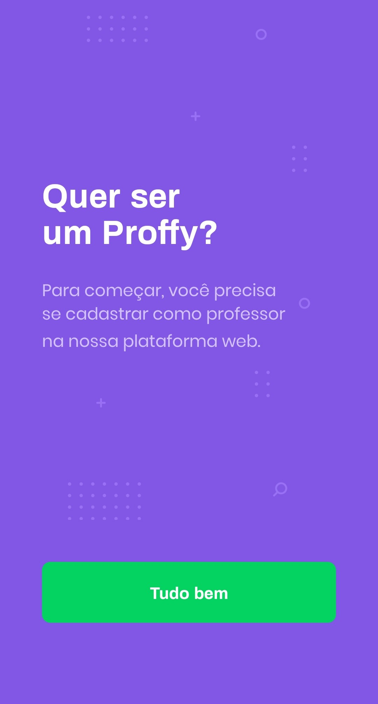

  

# Introdução

Projeto desenvolvido na 2° edição da Next Level Week realizada pela Rocketseat.

Trata-se de uma plataforma para conexão onde alunos podem agendar aulas com professores de diversas disciplinas.

O projeto foi desenvolvido utilizando as tecnologias ReactJS no frontend, NodeJS na construção da API e React Native para a aplicação mobile.

<h2 align="center">Tela Principal da aplicação WEB</h2>

  

<h2 align="center">Telas da aplicação mobile</h2>

    
    
    
    
    

